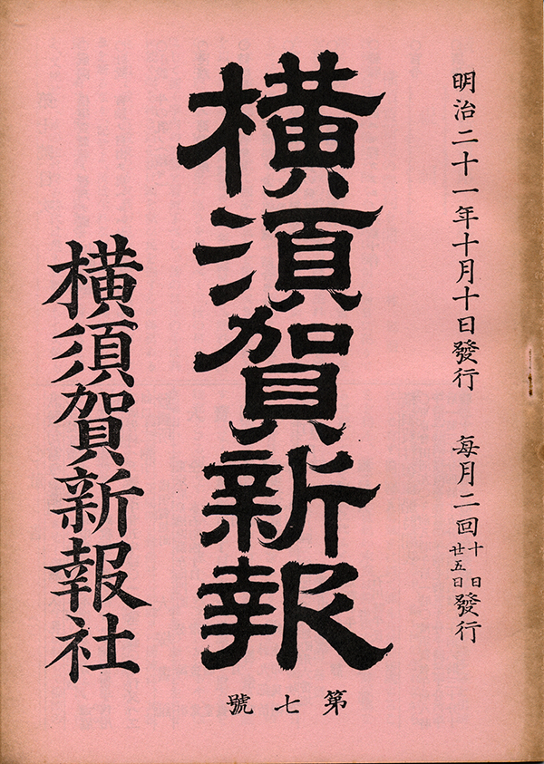
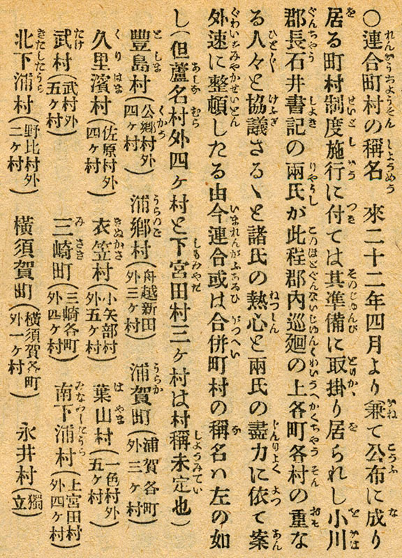

# 葉山町はなぜ「葉山」なのか

**小形克宏**

## よく分からない葉山町の起源

葉山町は、どうして「葉山」と名付けられたのでしょう？　一見簡単に思えるこの疑問、じつはいまだに「よく分からない」が現状なのです。

葉山が初めて自治体名になったのはいつか、という質問なら答えは簡単、明治22（１８８９）年4月1日です。このとき、明治期における地方行政ルールの集大成といえる法律「市制」「町村制」（以下、まとめて市町村制）が施行され、一色、木古庭、上山口、下山口、堀内、長柄の6ヵ村が合併する形で「葉山村」が誕生しました。また、後述しますが6ヵ村の村域は江戸期からつづくもので、そのまま現在の大字名にもなっています。

合併で誕生した葉山村ですが、その36年後の大正14（１９２５）年1月1日に「葉山町」になった際も、そして昭和31（１９５６）年の「昭和の大合併」の際も、平成15（２００３）年〜平成17（２００５）年の「平成の大合併」の際も、一度も合併をすることはありませんでした。葉山町の範囲は１３２年前の葉山村のままであり、同時にそれは江戸期の6ヵ村の範囲とも一致しているという、おそらく日本でも希少な例に属するわけです。

ところがです、その6ヵ村が合併した際、なぜ「葉山」の名前が選ばれたのか、これがまったく分からない。地名としての葉山という語が初めて文献に現れるのは、南北朝期の文和2（１３５３）年6月26日付「森戸神社文書」です。同神社に平某氏が「相模国葉山郷内オリ田大（二百四十歩）」を寄進して「祈禱精誠ならびに心中祈願成就」を願ったことが記録されています（『葉山の歴史とくらし』葉山町、80ページ、２０１５年）。

また戦国期、後北条家が支配した伊豆、相模、武蔵各国の郷村名、貫高（石高）、支配者名を列記した『小田原所領役帳』にも「葉山郷」が見え、その範囲は後の堀内村と一色村を合わせたものと推定されます（前掲『葉山の歴史とくらし』83ページ）。

しかし、ここでいう「郷」とは南北朝期から戦国期まで日本各地に存在した、複数の村を包括する中間支配機構、郷村／惣村です。したがって徳川の治世が始まると「葉山郷」は姿を消します。それがなぜ、３００年近くを隔てて明治21年に復活したのでしょう？

## 図書館で見つけた明治21年の雑誌記事

もしかしたら、その謎を解くかもしれない史料を、私は横須賀市立中央図書館で見つけることができました。

それは『横須賀新報』という政論／時事雑誌に掲載された記事です（図1）。版元は横須賀旭町（現在の大滝町の一部）の横須賀新報社で、明治21（１８８８）年9月25日に創刊されています。創刊号に「第6号」とあるのが不思議ですが、これは前身である学術雑誌『言泉雑誌』の号数をそのまま引き継いだためです。当初は月2回、第9号から月3回発行。判型はA5判で全体は30ページ程。少なくとも明治22（１８８９）年５月に第26号まで刊行されたことは分かっていますが、全体の号数は不明です。

{width=200}

発行に自由党関係者が関わっていることから、自由民権運動に刺激され、全国で次々と誕生しては消えていった新聞雑誌の一つと言えそうです。１９７５年に横須賀新報復刻刊行会から全2巻で復刻されており、この私の説明や複写図版も同書によることをお断りします。

では記事を見てみましょう（図2）。この頃は近代的な日本語表記が定まっておらず、見てのとおり句読点がありません。旧字旧仮名ということもあり、慣れない人には内容が頭に入ってこないかもしれません。

{width=450}

そこで、以下に内容を抜粋しましょう。カッコ内は私の補足です。

- 来年4月に施行予定の町村制の（合併）準備のため、三浦郡の小川（茂周）郡長と石井（三郎）書記の2名が郡下の各町村を巡回し、幹部と協議中とのこと
- 案に相違して両氏の尽力によりスムーズに合併が進みそうだ
- 合併後の名称は次のとおり

## 新村名のスクープ記事

そうして、記事の後半では施行の半年も前というのに、合併後の新村名（町名は変更なし）の数々がスクープされており、その一つに我が葉山村の名前があるというわけなのです。

ただし、史実と付き合わせるといくつかの村名に細かな誤記や食い違い、脱落があるのはご愛敬です。以下は誤記を訂正し、記事の段階では未定だった2村と脱落していた1村を加え、あわせて合併前の各町村名を追記したリストです（興味のある方は図2と見比べてください）。行内の順はそれぞれ、「新町村名（連合戸長役場名）連合に含まれる各町村名」です。冒頭の「▼」は、新村名が合併前のいずれの村名とも異なっているものを表します（後述）。また、旧字は新字に、漢数字は算用数字に置き換えました。

- ▼**豊島村**（公郷村外四ヵ村）公郷村、深田村、中里村、佐野村、不入斗村
- **浦郷村**（船越新田村外三ヵ村）船越新田、浦郷村、田浦村、長浦村
- **浦賀町**（浦賀各町外三ヵ村）浦賀宮下町、同新井町、同州崎町、同新町、同大ヶ谷町、同築地古町、同築地新町、同谷戸町、同田中町、同紺屋町、同蛇畠町、同浜町、同荒巻町、同芝生町、同高坂町、同川間町、同吉井町、同久比里町、大津村、走水村、鴨居村、公郷村飛地、内川新田飛地
- ▼**久里浜村**（佐原村外四ヵ村）佐原村、内川新田、八幡久里浜村、久村、岩戸村
- **衣笠村**（小矢部村外五ヵ村）小矢部村、大矢部村、森崎村、衣笠村、金谷村、平作村、佐野村飛地、不入斗村飛地
- ▼**葉山村**（一色村外五ヵ村）一色、木古庭、上山口、下山口、堀内、長柄
- ▼**武山村**（武村外五ヵ村）武村、須軽谷村、林村、大田和村、長井村飛地
- **三崎町**（三崎各町外四ヵ村）三崎町、諸磯村、小網代村、城ヶ島村、六合村
- ▼**南下浦村**（上宮田村外四ヵ村）金田村・上宮田村・菊名村・毘沙門村・松輪村
- ▼**北下浦村**（野比村外三ヵ村）長沢村、野比村、津久井村
- **横須賀町**（横須賀各町外一ヵ村）横須賀元町、同坂本町、同汐入町、同湊町、同汐留町、同汐留新道、同谷町、同諏訪町、同旭町、同稲岡町、同山王町、同小川町、同大滝町、同若松町、同楠ヶ浦町、同泊里町、逸見村
- **長井村**（独立）
- ▼**中西浦村**（芦名村外四ヵ村）芦名村、長坂村、荻野村、佐島村、秋谷村
- ▼**初声村**（下宮田村外三ヵ村）三浦郡入江新田、高円坊村、下宮田村、三戸村、和田村
- ▼**田越村**（逗子村外六ヶ村）桜山村、逗子村、山野根村、沼間村、池子村、久木村

なお、三浦半島におけるこの時期の町村位置を確認するには、横須賀市による以下のページをご覧ください。上記リスト作成にあたっても、大変参考にさせていただきました。

[市制、町村制の施行（明治時代）](https://www.city.yokosuka.kanagawa.jp/0520/emaki/meiji/meiji_data6.html)
